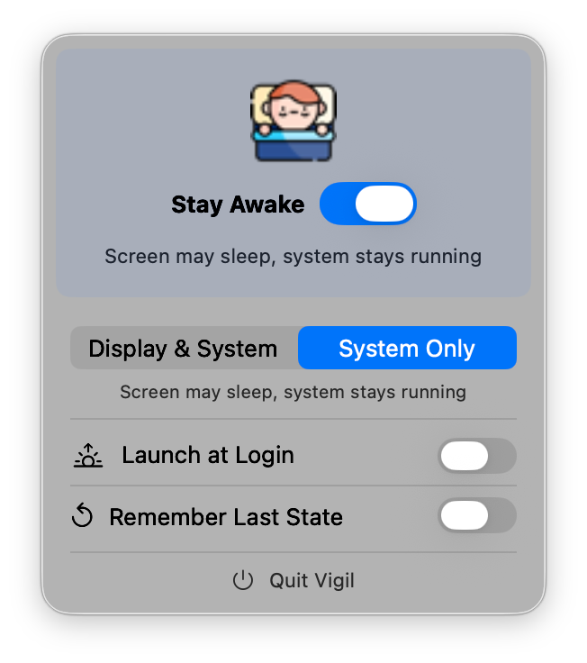
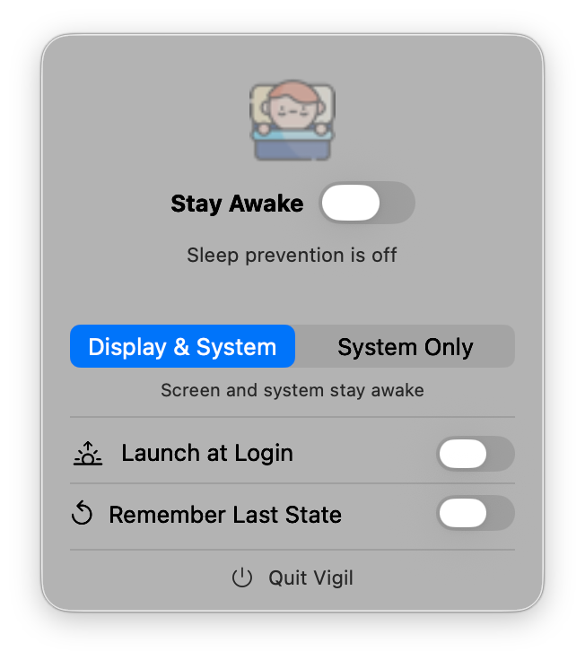

# Vigil

A lightweight macOS menu bar utility that prevents your Mac from sleeping. No bloat, no subscriptions, no unnecessary features — just a toggle in your menu bar.

## Why

Amphetamine is great but heavyweight. Vigil exists because keeping a Mac awake shouldn't require a complex app with dozens of features you'll never use.

Vigil uses the same kernel API (`IOPMAssertionCreateWithName`) that powers `caffeinate` — but instead of a terminal command, you get a menu bar icon. One click to keep your Mac awake, one click to stop.

## Features

- **Two sleep prevention modes**: "Display & System" keeps everything awake; "System Only" lets the screen sleep while preventing idle system sleep
- **Launch at Login**: optional, off by default
- **Remember Last State**: optionally restores the previous state on launch
- **Menu bar only**: no Dock icon, no Cmd+Tab entry — stays out of your way

<p align="center">
  
  &nbsp;&nbsp;
  
</p>

## How It Works

Vigil creates [IOPMAssertions](https://developer.apple.com/documentation/iokit/iopmlib_h) — the same mechanism macOS uses internally to prevent sleep during downloads, presentations, and Time Machine backups. The OS automatically releases all assertions if the app crashes or quits, so there's no risk of leaked state.

| Mode | Idle sleep | Display sleep |
|------|-----------|---------------|
| Display & System | Blocked | Blocked |
| System Only | Blocked | Allowed |

Lid close, manual sleep, and critical battery always override — Vigil can't prevent those (by design).

## Requirements

- macOS 15.6 (Sequoia) or later
- Apple Silicon or Intel

## Build from Source

```bash
git clone https://github.com/vasylenko/vigil.git
cd vigil
xcodebuild build -project app/Vigil.xcodeproj -scheme Vigil -configuration Release -destination 'platform=macOS'
```

The built app will be in `~/Library/Developer/Xcode/DerivedData/Vigil-*/Build/Products/Release/Vigil.app`.

## Verify It Works

```bash
pmset -g assertions | grep Vigil
```

When active, you'll see something like:
```
pid 1234(Vigil): PreventUserIdleDisplaySleep named: "Vigil is keeping your Mac and display awake"
```

## Tech Stack

Swift 6, SwiftUI, zero third-party dependencies. ~300 lines of code across three files.

## Credits

App icon based on "Awake" icon created by [Freepik - Flaticon](https://www.flaticon.com/free-icons/awake).
